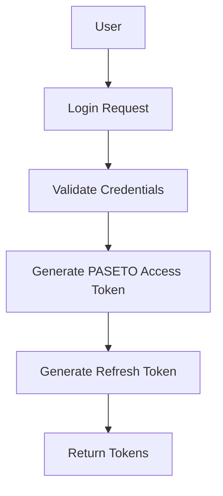
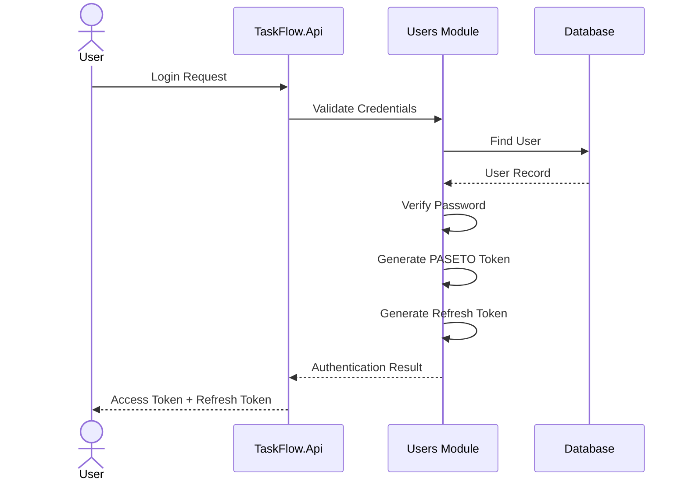
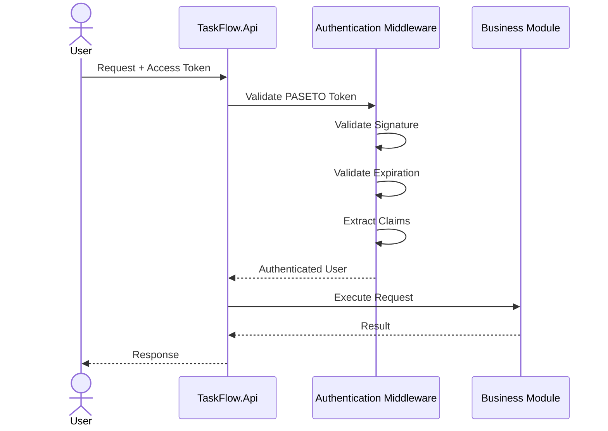
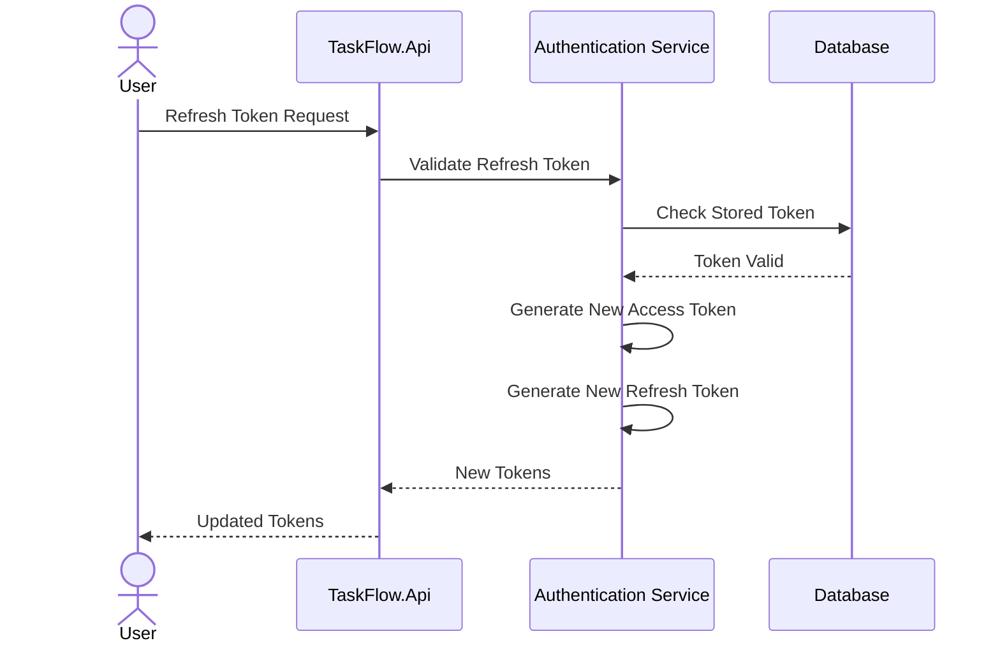
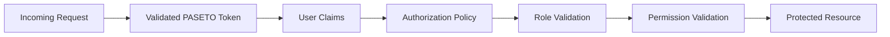

# Authentication Flow

## Overview

TaskFlow uses **PASETO (Platform-Agnostic Security Tokens)** for authentication instead of traditional JWT tokens.

PASETO provides a more secure tokenization approach by eliminating many common JWT implementation pitfalls and enforcing secure cryptographic defaults.

The authentication system supports:

* User Login
* Access Tokens
* Refresh Tokens
* Role-Based Authorization
* Policy-Based Authorization
* Secure Session Management

---

# High-Level Authentication Flow



---

# Login Flow



---

# Authenticated Request Flow



---

# Refresh Token Flow



---

# Authorization Flow



---

# Token Structure

## Access Token

Contains:

* User Id
* Email
* Roles
* Permissions
* Expiration Information

Purpose:

* Authenticate Requests
* Authorize Actions

---

## Refresh Token

Contains:

* Token Identifier
* User Reference
* Expiration Information

Purpose:

* Renew Access Tokens
* Maintain User Sessions

---

# Authentication Components

## Users Module

Responsibilities:

* Login
* User Validation
* Password Verification

---

## BuildingBlocks.Security

Responsibilities:

* PASETO Token Generation
* Token Validation
* Refresh Token Management

---

## Authentication Middleware

Responsibilities:

* Token Extraction
* Token Validation
* User Context Population

---

## Authorization Policies

Responsibilities:

* Role Validation
* Permission Validation
* Resource Protection

---

# Security Features

## PASETO Authentication

Benefits:

* Secure-by-default
* Modern cryptography
* Simpler implementation
* Protection against algorithm confusion attacks

---

## Refresh Tokens

Benefits:

* Reduced login frequency
* Better user experience
* Improved security

---

## Password Security

Features:

* Password Hashing
* Password Verification
* Secure Storage

---

# Future Enhancements

## Multi-Factor Authentication (MFA)

Features:

* Email Verification
* Authenticator Apps
* Backup Codes

---

## Social Authentication

Providers:

* Google
* Microsoft
* GitHub

---

## Session Management

Features:

* Active Sessions
* Device Tracking
* Session Revocation

---

## Security Monitoring

Features:

* Login Auditing
* Failed Login Detection
* Suspicious Activity Monitoring

```
```
