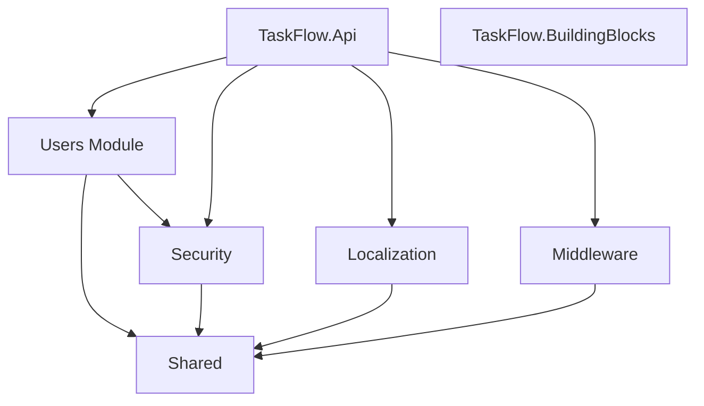
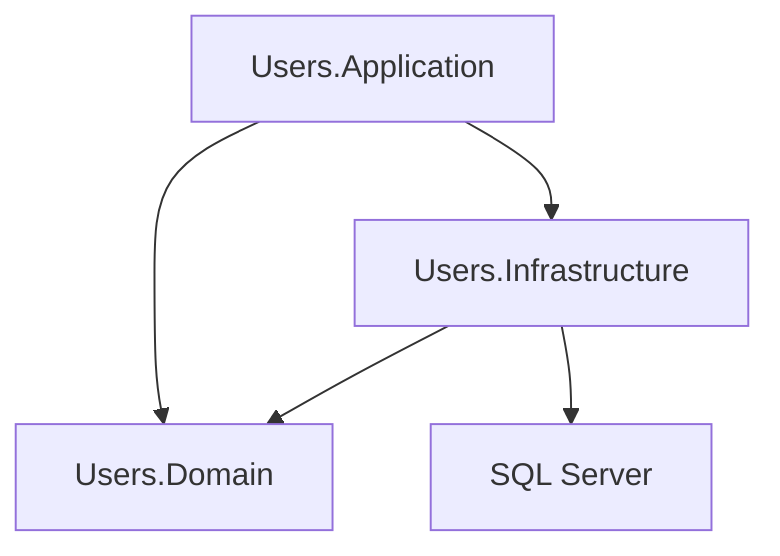
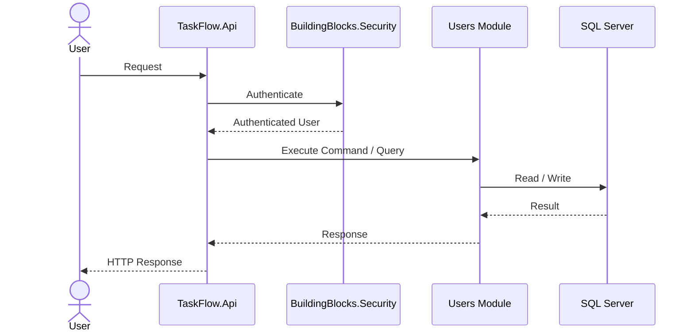
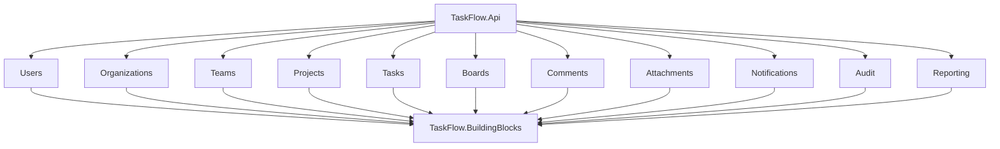

# Module Dependency Diagram

## Current Architecture



---

## Users Module Internal Structure



---

## Current Request Flow



---

# Target Architecture

The following diagram represents the planned evolution of the platform.



---

# Dependency Rules

TaskFlow follows strict dependency rules.

## Allowed

```text
Application → Domain
Application → Infrastructure Interfaces

Infrastructure → Domain

API → Modules

Modules → BuildingBlocks
```

## Not Allowed

```text
Domain → Infrastructure

Domain → API

Module → Module Direct References

BuildingBlocks → Modules
```

Modules should communicate through contracts, events, or application boundaries rather than direct coupling.

---

# Architectural Benefits

* Clear Module Boundaries
* Independent Business Domains
* High Testability
* Low Coupling
* Easy Feature Expansion
* Future Microservice Readiness
* Maintainable Codebase

```
```
