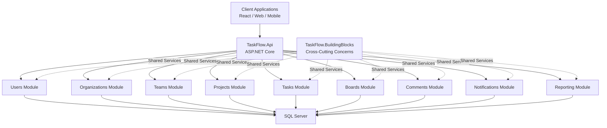
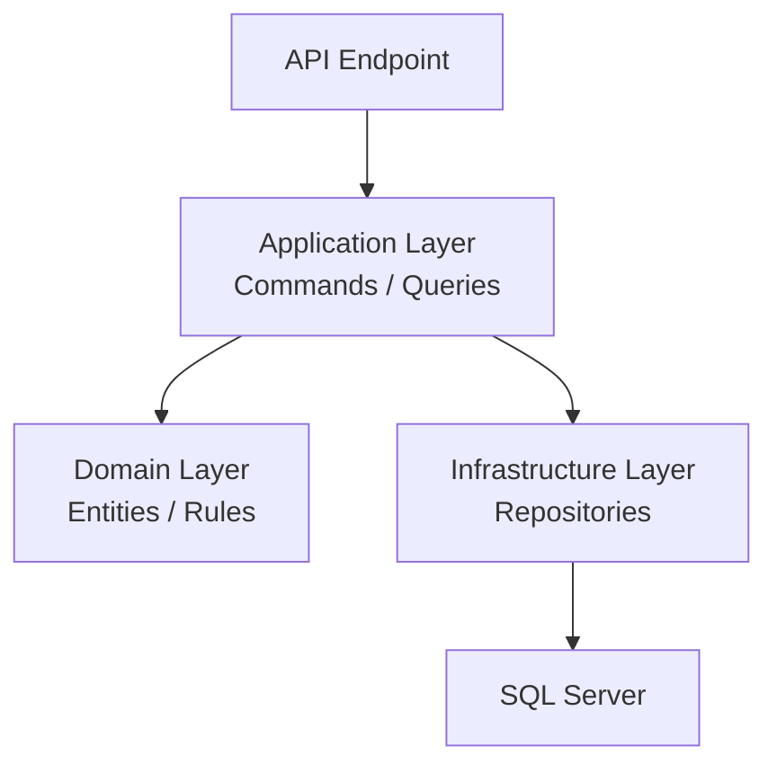
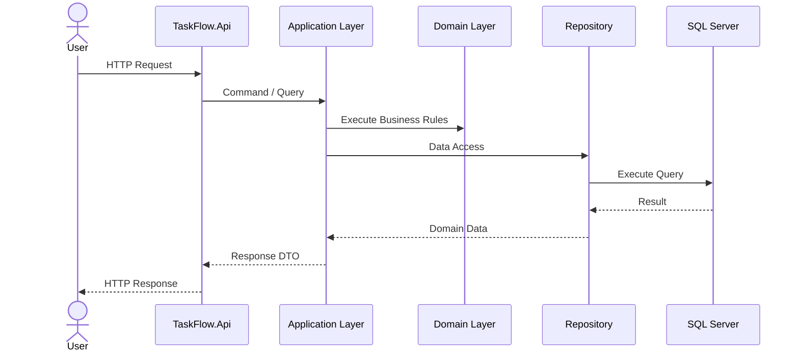
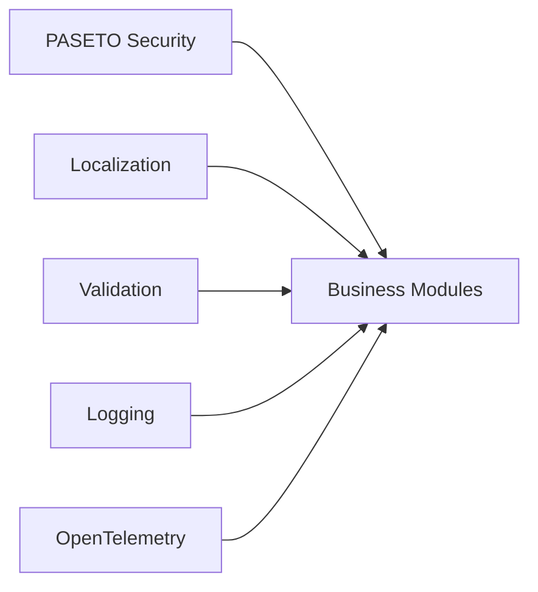

# System Architecture Diagram

## High-Level Architecture

---

## Internal Module Architecture

---

## Request Processing Flow

---

## Cross-Cutting Architecture

---

## Architectural Characteristics

### Architecture Style

* Modular Monolith
* Clean Architecture
* Domain-Driven Design
* CQRS
* Vertical Slice Architecture

### Security

* PASETO Authentication
* Refresh Tokens
* Authorization Policies

### Localization

* English
* Urdu
* Extensible Multi-Language Support

### Observability

* OpenTelemetry
* Distributed Tracing
* Metrics
* Logging

### Persistence

* SQL Server
* Entity Framework Core

### Future Evolution

The architecture is intentionally designed to allow future extraction of modules into independent microservices if required.
